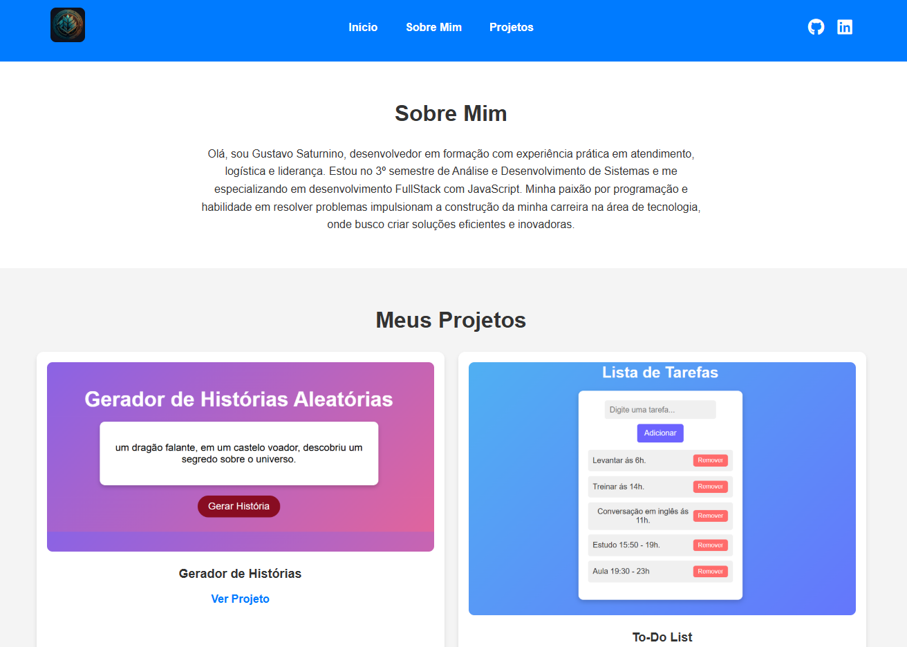

# Portfólio Pessoal - Gustavo Saturnino

Bem-vindo ao meu primeiro portfólio! 🌟



## Sobre Mim

Olá, meu nome é Gustavo Saturnino, e iniciei minha jornada na programação há dois meses. Desde então, tem sido uma experiência incrível e cheia de aprendizado. Estou cursando **Análise e Desenvolvimento de Sistemas** e um curso técnico focado em **desenvolvimento FullStack com JavaScript**. Meu objetivo é evoluir constantemente e construir uma carreira sólida na área de tecnologia.

Este portfólio é meu primeiro passo para compartilhar meu progresso, mostrar projetos nos quais trabalhei e demonstrar minhas habilidades em **HTML**, **CSS** e **JavaScript**.

---

## Objetivo do Portfólio

- **Praticar**: Aplicar os conceitos aprendidos ao longo do meu aprendizado em programação.
- **Mostrar meu progresso**: Demonstrar os projetos iniciais que desenvolvi, com foco em organização e usabilidade.
- **Criar presença online**: Disponibilizar meu portfólio como um cartão de visitas para oportunidades futuras.

---

## Funcionalidades

1. **Design Responsivo**:
   - Compatível com diversos dispositivos.
   - Ajuste automático dos elementos para diferentes tamanhos de tela.

2. **Menu de Navegação**:
   - Links rápidos para seções como "Início", "Sobre Mim" e "Projetos".

3. **Seção de Projetos**:
   - Projetos apresentados com imagens e links para visualização direta.
   - Efeito "hover" para dar destaque aos projetos ao passar o mouse.

4. **Redes Sociais**:
   - Links para meu [GitHub](https://github-readme-stats.vercel.app/api?username=Gustavo-Saturnino-1997&show_icons=true&theme=radical) e [LinkedIn](https://github-readme-stats.vercel.app/api/top-langs/?username=Gustavo-Saturnino-1997&layout=compact&theme=radica).

---

## Tecnologias Utilizadas

- **HTML5**
- **CSS3**
- **JavaScript**

---

## Como Visualizar

1. Clone este repositório:
   ```bash
   git clone 

2. Abra o arquivo index.html no navegador.


        Projetos Incluídos
Gerador de Histórias:
Um aplicativo divertido para criar histórias personalizadas com base nas escolhas do usuário.
To-Do List:
Uma lista de tarefas simples e funcional para organizar seu dia.
Considerações Finais
Este é apenas o início da minha jornada como desenvolvedor. A cada dia, busco aprender algo novo e aprimorar minhas habilidades. Espero que você goste do portfólio e fique à vontade para compartilhar feedbacks ou entrar em contato comigo.

LinkedIn: Perfil no LinkedIn
GitHub: Perfil no GitHub
WhatsApp: Entrar em Contato
Obrigado por visitar meu portfólio! 🚀